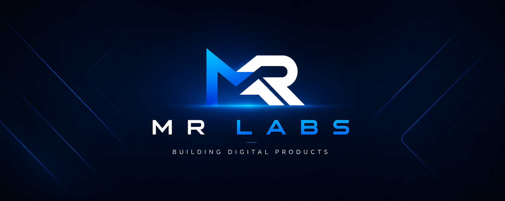

 

# MR Labs

### Building Digital Products

Modern applications • AI • Dashboards • Automation

---
## About

MR Labs is my digital product studio where ideas become production-ready software.

I design and build modern applications, intelligent dashboards, automation tools and AI-powered solutions with a strong focus on user experience, clean architecture and long-term maintainability.
## Featured Projects

🧠 **Lembretes**
> Modern reminder application focused on productivity.

📊 **Dashboard Gerente**
> Business intelligence platform for retail management.

📈 **Dashboard Regional**
> Regional analytics and performance monitoring.

⏰ **Hourly Beep**
> Modern recreation of the classic Casio hourly chime.

👥 **ShiftList**
> Intelligent workforce scheduling.
---
 

## 🚀 Featured Products

<table>
<tr>
<td width="50%">

### 🧠 Lembretes
A modern reminder app designed to help people stay organized, productive and focused.

</td>

<td width="50%">

### 📊 Dashboard Gerente
Business intelligence platform built for retail management and decision making.

</td>
</tr>

<tr>
<td width="50%">

### 📈 Dashboard Regional
Analytics platform for regional performance and operational insights.

</td>

<td width="50%">

### ⏰ Hourly Beep
A modern recreation of the classic Casio hourly chime experience.

</td>
</tr>

<tr>
<td colspan="2">

### 👥 ShiftList
Smart workforce scheduling for retail teams.

</td>
</tr>
</table>

---

## ⚡ Core Technologies

---

## 🎯 Current Focus

- 🚀 Expanding the MR Labs ecosystem
- 🧠 Building productivity applications
- 🤖 AI-powered software solutions
- 📊 Business intelligence platforms
- ☁️ Cloud-native architectures

---

## 🤝 Connect

- 💼 LinkedIn
- 🐙 GitHub
- 📧 Contact